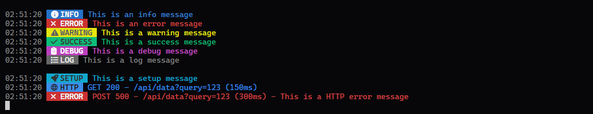
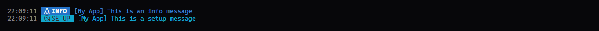
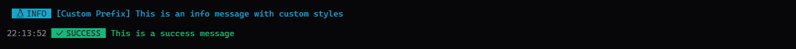

<h1 id="top" align="center">
  
  Logginlys
</h1>

<br />


<pre align="center">
  <a href="#installation">📦 SETUP</a> • <a href="#configuration">⚙️ CONFIGURATION</a>
</pre>


<br />

<div align="center">
  &nbsp;&nbsp;&nbsp;
  &nbsp;&nbsp;&nbsp;
  &nbsp;&nbsp;&nbsp;
  &nbsp;&nbsp;&nbsp;
  &nbsp;&nbsp;&nbsp;
  
</div>


<h2 id="about">
  
  About
</h2>

<table border="0">
<tr>
<td>
Loglys is a lightweight, high-performance TypeScript logging library designed to provide a consistent visual experience across both Node.js (Terminal) and Browser environments.

Forget about messy `console.log` statements. Loglys automatically detects your environment and applies beautiful ANSI styles or CSS badges to keep your debugging process organized and readable.
</td>
</tr>
</table>

<br />


<h2 id="table-of-content">
  
  Table of content
</h2>

- [ About](#about)
- [ Requirements](#requirements)
- [ Installation](#installation)
- [ Usage](#usage)
- [ Configuration](#configuration)


<h2 id="requirements">
  
  Requirements
</h2>

-  node >= **22.17.0**
-  bun >= **1.1.0**

<br />


<h2 id="installation">
  
  Installation
</h2>

<h3> Bun</h3>

```bash
bun i -D logginlys
```

<h3> Npm</h3>

```bash
npm i -D logginlys
```

<h3> Pnpm</h3>

```bash
pnpm i -D logginlys
```

<h3> Yarn</h3>

```bash
yarn i -D logginlys
```

<br />


<h2 id="usage">
  
  Usage
</h2>

General use is as simple as importing the `log` object and calling its methods:

```ts
  import { log } from 'logginlys';

  log.info('This is an info message');
  log.success('This is a success message');
  log.error('This is an error message');
  log.warning('This is a warning message');
  log.debug('This is a debug message');
  log.blank();
  log.setup('This is a setup message');
  log.http({
    url: 'https://example.com/api/data?query=123',
    method: 'GET',
    status: 200,
    time: 150
  });
  log.httpError('This is a HTTP error message', {
    url: 'https://example.com/api/data?query=123',
    method: 'POST',
    status: 500,
    time: 300
  });
```

The result will be this:



<br />


<h2 id="configuration">
  
  Configuration
</h2>

You can customize the logger by passing an options object to the `Logger` class constructor or to each log method. The options object can have the following properties:

- `prefix` (string): A custom prefix to be added before each log message.
- `isDev` (boolean): A flag to enable or disable logging. If set to `false`, all log methods will be no-ops.
- `showTimestamp` (boolean): A flag to enable or disable timestamps in log messages.
- `blankAbove` (boolean): A flag to add a blank line above the log message.
- `blankBelow` (boolean): A flag to add a blank line below the log message.
- `icon` (string): A custom icon to be displayed before the log message (only for ansi).
- `emoji` (string): A custom emoji to be displayed before the log message (only for browser).
- `ansi` (object): An object to customize ANSI styles for terminal logs, with properties `color` and `bg` for text color and background color respectively.
- `css` (object): An object to customize CSS styles for browser logs, with properties `color` and `bg` for text color and background color respectively.
- `log`, `info`, `http`, `debug`, `error`, `setup`, `warning`, `success` (object): Objects to customize styles for specific log levels, with the same properties as above.

To costomize the logger globally, you can do the following:

```ts
import { LogManager } from 'logginlys';

const logger = new LogManager({
  prefix: '[My App]',
  isDev: true,
  showTimestamp: true,
  blankAbove: false,
  blankBelow: false,
  info: {
    icon: '\uebc6',
    emoji: 'ℹ️',
  },
  setup: {
    icon: '\uebd7',
    emoji: '⚙️',
    ansi: {
      color: '\u001b[0;36m',
      bg: '\u001b[46m'
    }
  },
});

logger.info('This is an info message');
logger.setup('This is a setup message');
```

Resulting in this:



In case you want to customize one log message you can do the following: 

```ts
import { LogManager } from 'logginlys';

const log = new LogManager();

log.info('This is an info message with custom styles', {
  prefix: '[Custom Prefix]',
  showTimestamp: false,
  icon: '\uebc6',
  emoji: 'ℹ️',
  ansi: {
    color: '\u001b[0;36m',
    bg: '\u001b[46m'
  }
});
log.success('This is a success message', { blankAbove: true });
```

Resulting in this:



<br />


<pre align="center">
  <a href="#top">BACK TO TOP</a>
</pre>


<pre align="center">
  Copyright © All rights reserved,
  developed by LuisdaByte and
</pre>
<div align="center">
  
</div>

